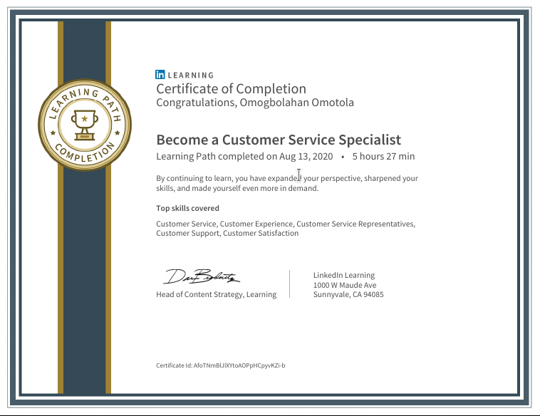

# Customer service specialist - LinkedIn Learning Path 

## Courses

1. Customer Service Foundations
1. Problem Solving and Trouble Shooting
1.  Building Rapport with Customers
1. Call Control Strategies
1. Handling Abusive Customers
1. Positive Conservations with Challenging Customers
1. De-Escalating Intense Situations
1. Serve Customers through Chat and Text

